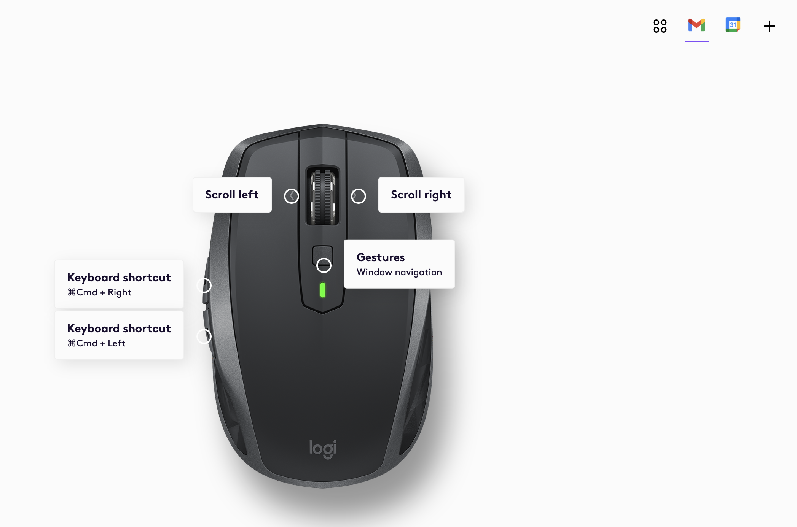

# Patty's Customization Notes
Assumes you're using a mac.
These are my preferences. You're not required to use these.

# Usage
* Run all plays: `ansible-playbook playbook.yml --ask-become-pass`
* Run specific play: `ansible-playbook playbook.yml --ask-become-pass --tag <tagname>`

# Customizations

## Chrome Apps
[Support for logitech mouse forward/back buttons](https://support.google.com/mail/thread/127551228/gmail-windowed-desktop-app-doesn-t-support-mouse-back-forward-buttons?hl=en) requires additional setup.
1. Add new chrome application
1. Specify keyboard shortcut. See image below

## PowerLevel Font
* https://github.com/romkatv/powerlevel10k/blob/master/font.md
* https://github.com/microsoft/vscode/issues/81497

## Themes
* Apple Terminal: https://github.com/arcticicestudio/nord-terminal-app

## JetBrains
By switching to `zsh`, environment variables in `.zshenv` are not automatically loaded when you bring up IntelliJ or GoLand. In Linux, we figured out how to [override the startup](https://github.com/appian/cloud-tools/blob/ubuntu-workstation/workstation/roles/zsh/templates/jetbrains-idea.zsh.desktop).

To workaround the fact that environment variables aren't loaded automatically, update the default run configuration and manually update the User Environment Variables.

## Goland
* Show control characters in Goland: https://stackoverflow.com/questions/9868796/how-to-display-hidden-characters-by-default-zero-width-space-ie-8203
* Disable code folding: https://www.jetbrains.com/help/go/code-folding-settings.html

## VSCode
* Configurations are stored it a settings.json file that gets copied after installation.

## Alfred
* [Replace Spotlight Search with Alfred](https://www.alfredapp.com/help/troubleshooting/cmd-space/)

# Reminders
* Enable notifications for Chrome in System Preferences > Notifications & Focus
  * Enable for calendar, chat, mail
* Updated default shell:
  * vscode (already in settings.json)
  * goland: https://www.jetbrains.com/help/go/terminal-emulator.html
* Add ssh key to cache/keychain: https://docs.github.com/en/authentication/connecting-to-github-with-ssh/generating-a-new-ssh-key-and-adding-it-to-the-ssh-agent
* Add [Logitech Support](https://www.logitech.com/en-us/software/logi-options-plus.html). Future: https://hulry.com/logitech-mx-master-3-review/
* The artifactory task will fail in dev-setup because your username in Stratus is not the same as your appian user name. Comment it out.